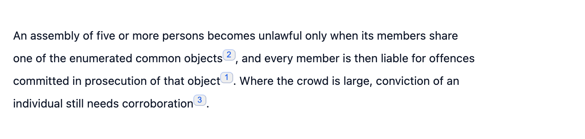
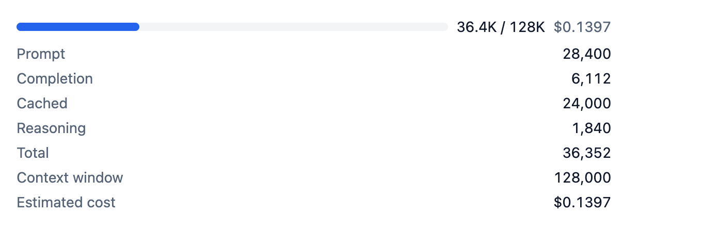
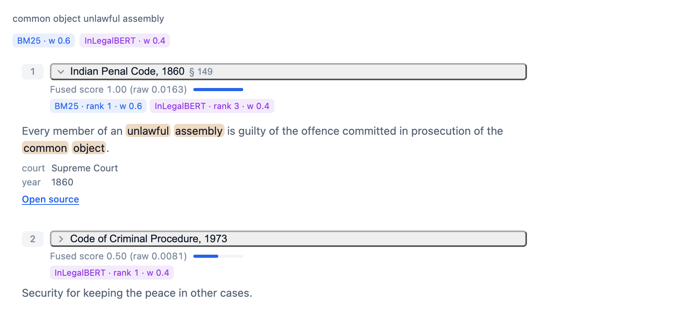
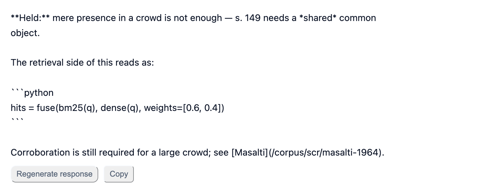
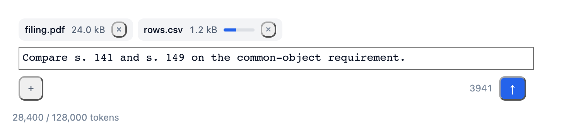

# atlas-ui

[](https://github.com/Bruhadev45/atlas-ui/actions/workflows/ci.yml)
[](./LICENSE)

Opinionated React + TypeScript + Tailwind components for the parts of an AI
application interface that mainstream component libraries do not ship:
streaming output, citations, confidence, tool traces, token budgets, retrieval
provenance, and the composer. It is deliberately **not** a design system — no
buttons, no modals, no reset — so it composes with shadcn/ui, MUI, Mantine, or
your own styles.

Seven components, no runtime dependency beyond Radix primitives, every one of
them keyboard-operable and axe-clean in both themes.

## Install

```sh
npm install atlas-ui
```

`react` and `react-dom` (>= 18) are peer dependencies; `tailwindcss` is an
optional peer you only need for [Mode B](#mode-b--your-app-already-uses-tailwind).

```ts
// One import, modern bundlers:
import { CitationChip, TokenMeter } from "atlas-ui";

// Or the per-component subpath, which guarantees you ship only what you import:
import { CitationChip } from "atlas-ui/citation-chip";
```

Then pick one of the two styling modes below — the components render unstyled
without it.

Every screenshot in this README is a real render, produced from the Storybook
static build by `npm run screenshots`.

---

## CitationChip



An inline citation marker that opens a source preview on hover *or* focus.
Hover open/close is debounced so the pointer can travel from the chip to the
card's link; a focus-opened preview never closes on `pointerleave`, only on
blur or `Escape`.

```tsx
import { CitationChip } from "atlas-ui/citation-chip";

<p>
  A common object requires shared intent
  <CitationChip
    index={1}
    source={{
      id: "sec-149",
      title: "Indian Penal Code, 1860",
      locator: "§ 149",
      snippet: "Every member of unlawful assembly guilty of offence committed…",
      score: 0.92,
      scoreLabel: "fused",
      retriever: "bm25 + InLegalBERT",
      url: "/corpus/ipc/149",
    }}
  />, not mere presence.
</p>
```

`variant` switches the marker between `numeric`, `dot` and `text`, and
`asChild` hands rendering to your own element when the chip has to be a link.

## ConfidenceBadge


A confidence level with an optional score and a calibration explainer. The four
levels each carry their own icon shape, so the badge survives greyscale and
colour-blind rendering; `confidenceFromScore` maps a raw score onto a level with
thresholds you can override.

```tsx
import { ConfidenceBadge, confidenceFromScore } from "atlas-ui/confidence-badge";

<ConfidenceBadge level={confidenceFromScore(0.91)} score={0.91} showScore />
```

## TokenMeter



Token usage against a budget, as a real `role="meter"`. It announces threshold
crossings once each rather than on every render, and `estimateCost()` is
exported on its own for the places you need the number without the UI.

```tsx
import { TokenMeter } from "atlas-ui/token-meter";

<TokenMeter
  usage={{ prompt: 28_400, completion: 6_112, cached: 24_000 }}
  budget={128_000}
  pricing={{ promptPerMTok: 3, completionPerMTok: 15, cachedPromptPerMTok: 0.3 }}
/>
```

## RetrievalTrace



Retrieval results with their provenance intact. `fromRagfuse` maps the JSON of
[ragfuse](https://github.com/Bruhadev45/ragfuse)'s `FusedHit` — either casing —
onto display fields, and `RetrievalTrace` renders the ranking as an `<ol>` in
which every hit says, in text, which retriever found it and where:

```tsx
import { RetrievalTrace } from "atlas-ui/retrieval-trace";
import { fromRagfuse } from "atlas-ui/utils";

<RetrievalTrace
  chunks={fromRagfuse<Statute>(response.hits, {
    getTitle: (s) => `${s.act} ${s.section}`,
    getText: (s) => s.text,
    getUrl: (s) => `/corpus/${s.id}`,
  })}
  query={question}
  highlightQueryTerms
  retrievers={[
    { name: "bm25", label: "BM25", weight: 0.6 },
    { name: "dense", label: "InLegalBERT", weight: 0.4 },
  ]}
/>
```

Each badge reads `bm25 · rank 1 · w 0.6`; colour is a redundant second channel,
so a four-retriever trace stays intelligible read aloud or in greyscale.

## ToolCallTimeline

![A ToolCallTimeline with two expanded calls, nested children, and an apiKey argument rendered as "[redacted]"](docs/media/tool-call-timeline.png)

An agent's tool calls as a nested disclosure list. Arguments and results are
serialised through `safeStringify`, which **redacts credential-shaped keys by
default** — a debug timeline is exactly the surface that ends up in a screenshot
or a support ticket. `redactKeys` widens that list rather than replacing it;
`redactKeys={[]}` is the explicit opt-out.

```tsx
import { ToolCallTimeline } from "atlas-ui/tool-call-timeline";

<ToolCallTimeline
  calls={[
    { id: "t1", name: "classify_query", status: "ok", durationMs: 120,
      args: { query: "common object under s.149" },
      result: { intent: "statute_lookup", jurisdiction: "IN" } },
    { id: "t2", name: "hybrid_retrieve", status: "running", startedAt: Date.now() - 1400,
      args: { top_k: 8, weights: { bm25: 0.6, dense: 0.4 } },
      children: [
        { id: "t2a", name: "bm25_search", status: "ok", durationMs: 61 },
        { id: "t2b", name: "dense_search", status: "running" },
      ] },
  ]}
  redactKeys={["ssn"]}
/>
```

Rows are ordinary buttons in the natural tab order — `Enter`/`Space` toggle,
and `ArrowRight`/`ArrowLeft`/`Home`/`End` are added on top for tree-style
movement without trapping focus or stealing text selection inside a panel.
Every row's accessible name spells its status and duration out ("Succeeded,
120 milliseconds"), so colour and the five status shapes are reinforcement,
never the signal.

## StreamingMessage



Model output as it arrives. The component owns no transport — `content` and
`status` are props, so it composes with the Vercel AI SDK, a raw
`ReadableStream`, or a WebSocket without fighting any of them:

```tsx
import { StreamingMessage } from "atlas-ui/streaming-message";

<StreamingMessage
  content={text}
  status={isLoading ? "streaming" : "complete"}
  announceOn="sentence"
  throttleMs={50}
  onStop={stop}
  onRegenerate={reload}
/>
```

It also ships no markdown renderer — that would be a runtime dependency and a
choice of renderer this library has no business making. The default output is
text, which is why the screenshot above shows `**Held:**` verbatim; pass your
own through `renderContent(text, { status, isPartial })` and the same text
arrives already repaired.

The streaming text is deliberately **not** a live region: marking a growing
paragraph `aria-live` makes a screen reader re-read it on every chunk. Instead
the container is `aria-busy` while streaming and a separate `sr-only` region
announces either the finished answer or each sentence as it terminates.

`completePartialMarkdown` (exported on its own, and applied by default before
`renderContent` runs) is what keeps half-written syntax from flashing: it
closes an open code fence, balances trailing `**` / `*` / `_` / `` ` `` with a
stack so nested marks close innermost-first, and drops a `[label](htt` that has
not finished arriving. Finished markdown is a fixed point of the pass, so it is
safe to leave on for the whole stream.

```ts
completePartialMarkdown("the *ratio decidendi");   // "the *ratio decidendi*"
completePartialMarkdown("```py\nimport os");        // "```py\nimport os\n```"
completePartialMarkdown("see [the act](htt");      // "see "
```

`throttleMs` caps the render rate for fast streams and always flushes the exact
final `content` on the transition out of `"streaming"`, so the buffer is a
rate limiter and never a source of truth.

## AssistantComposer



The input side: a real `<form>` whose send control is a `<button type="submit">`,
with a slash-command palette, controlled attachments and an autosizing textarea.

```tsx
import { AssistantComposer } from "atlas-ui/assistant-composer";

<AssistantComposer
  value={text}
  onValueChange={setText}
  onSubmit={({ text, attachments }) => ask(text, attachments)}
  maxLength={4000}
  commands={[
    { id: "cite", name: "cite", description: "Cite a specific section", group: "Retrieval" },
    { id: "plain", name: "plain", description: "Explain in plain English", group: "Style" },
  ]}
  onCommandSelect={(cmd, ctx) => setText(ctx.replace(`/${cmd.name} `))}
  footer={<TokenMeter usage={usage} budget={128_000} className="text-xs" />}
/>
```

Two decisions carry most of the component. **Attachments are controlled-only**:
the composer never holds a `File`. It validates against `accept`, `maxFiles`
and `maxFileSize`, reports the losers through `onFileRejected(file, reason)`,
and hands the survivors to `onAttachmentsAdd` — upload, progress, retry and
`URL.revokeObjectURL` stay with the app, because a component that guesses at
those leaks memory and cancels the wrong request. Drag-and-drop and paste run
the same validation, and neither is ever the only path: a visually hidden file
input sits behind a real, focusable attach button.

**`Escape` never touches the text.** It closes the command menu and nothing
else — no clearing the draft, no stopping the stream. There is no undo for a
destroyed prompt. Enter sends (`submitOn="mod-enter"` to invert it),
`Shift+Enter` inserts a newline, `Cmd/Ctrl+Enter` always sends, and while the
menu is open the arrow keys, `Home`/`End`, `Enter` and `Tab` belong to the
menu — so `Enter` picks a command instead of sending a half-typed message.

`useSlashCommands` is exported on its own for composers this one does not fit.
It owns menu state and no text: `onSelect` hands you a context whose
`replace(text)` is a **pure function returning a new string**, which you apply
to your own state.

```tsx
import { useSlashCommands } from "atlas-ui/hooks";

const menu = useSlashCommands({
  commands,
  onSelect: (cmd, ctx) => setValue(ctx.replace(`/${cmd.name} `)),
});

<textarea {...menu.getInputProps()} value={value} onChange={onChange} />;
{menu.isOpen && <ul {...menu.getListProps()}>{/* menu.items */}</ul>}
```

---

## Styling — two consumption modes

The library owns no global styles and ships no preflight/reset. Every block
element it renders zeroes the user agent's own margins locally instead, so
dropping a component into a page with no reset does not inherit `1em`
paragraph margins or a list bullet from the browser.

### Mode A — no Tailwind in your app

Import the prebuilt stylesheet once, in your app root:

```ts
import "atlas-ui/styles.css";
```

That file contains the design-token layer plus every utility the components
use, prebuilt with `preflight: false`, so it cannot reset your application.

### Mode B — your app already uses Tailwind

**Tailwind 3.4** — add the preset and let Tailwind scan the library's `dist`:

```js
// tailwind.config.js
import atlasPreset from "atlas-ui/preset";

export default {
  presets: [atlasPreset],
  content: [
    "./src/**/*.{ts,tsx}",
    "./node_modules/atlas-ui/dist/**/*.{js,cjs}", // required
  ],
};
```

```ts
import "atlas-ui/tokens.css";
```

**Tailwind 4** — import the theme mapping and the tokens in your app CSS:

```css
@import "atlas-ui/theme.css";
@import "atlas-ui/tokens.css";
```

Known limitation: a Tailwind 3 consumer using a `prefix` cannot use Mode B
(the `dist` class literals are unprefixed) — use Mode A instead.

Dark mode: add `.dark` or `data-theme="dark"` to any ancestor (usually
`<html>`). Tokens flip in `tokens.css`; there is not a single `dark:` class in
the components.

## Bundle size

Measured by `npm run size` on the committed build — minified and brotlied.
Per-component rows exclude the shared runtime (Radix primitives, `clsx`,
`tailwind-merge`), which the barrel row counts once:

| Entry point | Size | Budget |
|---|---|---|
| `atlas-ui/confidence-badge` | 1.75 kB | 4 kB |
| `atlas-ui/streaming-message` | 2.36 kB | 6 kB |
| `atlas-ui/citation-chip` | 2.44 kB | 16 kB |
| `atlas-ui/token-meter` | 2.73 kB | 5 kB |
| `atlas-ui/retrieval-trace` | 3.42 kB | 9 kB |
| `atlas-ui/tool-call-timeline` | 4.21 kB | 10 kB |
| `atlas-ui/assistant-composer` | 5.07 kB | 10 kB |
| `atlas-ui` (barrel, all seven **plus** the shared runtime) | 44.55 kB | 46 kB |
| `atlas-ui/styles.css` | 3.51 kB | 12 kB |

The budgets are enforced in CI, so a regression fails the build rather than
showing up in someone else's bundle analyser.

## Development

```sh
npm ci
npm test              # vitest + jsdom + axe, with coverage thresholds
npm run typecheck
npm run lint
npm run build         # tsup dual-format + the prebuilt stylesheet
npm run check:pkg     # publint + are-the-types-wrong
npm run size

npm run storybook     # the seven components, five story kinds each
```

Every story is also composed into the vitest run, so `play` functions are
keyboard contracts rather than documentation. To regenerate the screenshots in
this README:

```sh
npm run build:storybook
npm run screenshots   # needs Chrome or `npx playwright install chromium`
```

## License

MIT © Kandimalla Bruhadev
